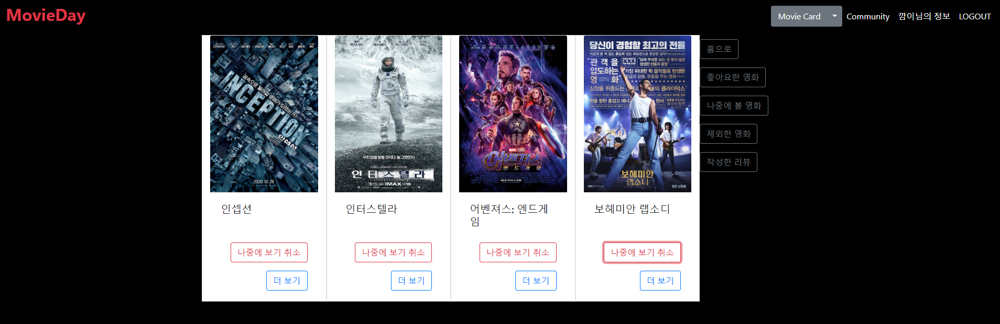

# SSAFY 1학기 최종 PJT

> 해당 프로젝트는 Django를 사용하여 제작했으며, vue를 CDN 방식으로 추가하여 일부 기능을 구현했습니다.
>
> 영화 데이터의 경우 TMDB의 데이터를 평점순, 출시일 순으로 정렬한 뒤 580개의 데이터를 가져오고,
> 그를 DB에 저장하여 활용했습니다.
>
> ### 팀원 정보 및 팀의 역할 분배
>
> * **팀장 : 이동혁** : Movies App의 전반적인 기능 개발 / Accounts App의 Detail 페이지에 대한 기능 개발
> * **팀원 : 박성빈** : Accounts App의 기능 개발 / Community App의 기능 개발
> * **공통** : 전체적인 페이지 목업 제작 및 CSS 스타일링
>
> 
>
> ### 목표 서비스 구현 및 실제 구현 정도
>
> 초기 구상했던 서비는 일부 구현되었고, 나머지는 시간 문제로 인해 미구현상태입니다.
> (정확히는 코드는 작성했지만, 배치를 하지 못해서 제외된 기능이 일부 있습니다.)
>
> 또한, 비효율적으로 작성된 코드를 꾸준히 리팩토링 하려는 계획을 가지고 있습니다.
>
> 
>
> ### 데이터베이스 모델링(ERD)
>
> 
>
> 
>
> ### 기타
>
> 프로젝트의 초기 구상 단계가 잘못된 느낌이 들었습니다.
>
> 분명 초기에는 Django + 바닐라 JS를 사용하여 앱을 제작할 계획이었지만, 시간이 지나며
> Vue를 이용해서 프론트엔드를 구성하면서 Django 서버에 요청을 보내는 일이 하나둘씩 생기기 시작했습니다.
>
> 시간의 여유가 있었다면 프로젝트의 전반적인 진행을 멈추고, 한번 점검했을 것같은데,
> 시간이 부족하다는 핑계로 미처 점검하지 못한 것이 프로젝트의 미흡한 점으로 남은 것같습니다.
>
> 이후 코드를 리팩토링하면서 비효율적인 코드도 수정하고,
> 프로젝트의 구조적인 문제도 하나씩 해결해보려고 합니다.

# Movies App

## Index

> 전체 영화 개수와 리뷰의 개수를 보여주는 페이지입니다.
>
> * 로그인한 사용자의 경우 영화 목록(movies_list)로 이동 가능
> * 로그인 하지 않은 사용자의 경우 인증 관련(Signup / Login) 페이지로 이동 가능
> * 인증에 성공할 경우 Movie Card로 이동

## Movie Card

> 전체 영화 목록을 Bootstrap의 Card Component로 보여주는 페이지입니다.
>
> 카드의 아래 부분에는 해당 영화의 리뷰 목록으로 이동하는 버튼과
> Modal Component를 작동하는 버튼이 있어서 클릭 시 Modal이 출력됩니다.
> (Modal에서는 사용자가 영화의 정보를 볼 수 있으며, 좋아요, 제외, 목록에 추가 등 분류할 수 있음)

### Movie List

> 전체 목록을 context에 전달하고, pagination을 이용하여 보여주는 방식으로 작성했었으나,
> 너무 긴 로딩 시간(580개 Movie Data)로 인해 수정이 필요했습니다.
>
> 그 결과 각 페이지마다 원하는 장르, 정렬순서, 페이지 번호를 포함한 URL로 장고 서버에 요청을 보내서 각각의 페이지마다 필요한 16개의 영화와 관련된 정보만을 받아오고, 그를 렌더링하는 방식으로 작성했습니다.
> (로그인 이후 처음 화면이기 때문에 초기 로딩 비용이 적어야 된다고 생각했기 때문에 이렇게 작성했으나,
> 토글 비용이 너무 늘어나서 코드를 리팩토링할 계획중입니다.)
>
> 1. 초기 접속 시 처음 페이지(0) / 모든 장르(0) / 평점순(0) 으로 Django 서버에 요청을 보냅니다.
>
> 2. Vue Component에서 원하는 페이지에 해당하는 주소의 get_movies URL로 요청을 전달합니다.
>     
>     * 원하는 장르 / 정렬 순서도 같이 전달
>         (Ex, 2페이지, Adventure, 출시일 순 정렬을 원한다면 2, 1, 1을 전달)
>     
> 3. get_movies에서는 페이지 번호를 이용하여 영화들을 16개씩 끊어서 전달합니다.
>
> 4. 전달 받은 영화들을 한 페이지에 4x4 card component로 출력합니다.
>
> 5. 가장 하단에는 현재 페이지를 기준으로 -2~+2 페이지와
>
>     맨앞, 맨 뒤 페이지로 이동할 수 있는 버튼이 출력됩니다.
>
>     (해당 버튼을 클릭시 event.target.innerText를 이용해서 원하는 페이지 번호를 확인합니다.)
>
> 6. 버튼을 클릭할 경우 2번부터 반복하며, 현재 페이지의 가장 위로 이동합니다.
>
> 위 과정은 Vue Component를 사용하여 새로고침이 일어나지는 않지만,
> 새로운 페이지로 이동할 때마다 axios 요청을 Django 서버로 보낼 수 있어야 됩니다.
>
> ※ 해당하는 영화의 수가 16의 배수일 경우 마지막 페이지로 이동할 경우
> 빈 페이지를 출력하는 문제가 생겨서 그 경우에만 최대 페이지 수를 -1 해주었습니다.

### Movie Modal

> 영화에 대한 상세 정보와 분류버튼, 간단 리뷰 작성 기능이 있는 Modal입니다.
>
> 해당 버튼들은 모두 Vue Component를 사용하여 비동기적으로 작동하며,
> (이때문에 앞서 말한 토글 비용이 커지는 부작용이 있습니다.)
>
> 간단 리뷰 작성 시에는 GET으로 요청을 보내고,
> views.py 에서 Validation (중복 리뷰 존재 여부, 50자 이내 여부 등)을 검증하고,
> 검증 결과와 작성한 리뷰 등의 정보를 JsonResponse로 전달해줍니다.
>
> 검증 결과에 따라 사용자에게 안내창을 표시해주거나,
> 작성자가 작성한 리뷰를 최근 리뷰에 포함시켜줍니다.

## Movie Recommend

> 총 3가지의 방식으로 영화를 추천해주는 페이지입니다.
>
> 영화 데이터를 Bootstrap의 Carousel Component를 응용하여 6개씩 3페이지로 보여주고,
> 포스터 클릭 시 세부 정보를 Modal 로 출력합니다.
>
> 1. 사용자의 선호 장르와 유사한 장르를 평점순으로 추천 (컨텐츠 기반 필터링)
> 2. 사용자가 분류하지 않은 (좋아요, 제외, 목록에 추가하지 않은) 영화를 평점순으로 추천
> 3. 사용자의 현재 위치에 대한 날씨를 토대로 이미 정해진 알고리즘에 따라 특정 장르의 영화를 추천

### 1. 사용자의 선호 장르에 따른 추천

> 사용자가 좋아요한 영화들의 장르에 우선도를 +1하고,
> 사용자의 회원 정보에 있는 선호 장르들에 우선도를 +1해서
> 가장 우선도가 높은 장르 중 1개의 영화를 평점순으로 추천해줍니다.
> (해당하는 영화가 없거나, 선호도가 전부 0이라면 임의의 장르를 추천합니다.)

### 2. 사용자가 분류하지 않은 영화를 평점 순으로 추천

> 사용자가 좋아요, 제외, 목록에 추가 하지 않은 모든 영화들을 평점순, 출시일 순으로 정렬하고,
> 해당 순서에 따라 추천합니다.

### 3. 날씨 기준 추천

> 다음 순서로 작동합니다.
>
> 1. Geolocation API를 사용하여 사용자의 위치정보(위도, 경도)를 얻습니다.
>
> 2. 해당 위치 정보를 토대로 Open Weather Map API에 요청을 보내고,
>
>     날씨(Clear, Cloud 등)와 온도 정보를 받습니다.
>
> 3. 응답받은 데이터를 토대로 Django 서버에 요청을 보냅니다.
>
> 4. Django 서버에서는 그를 토대로 추천 장르와 추천 영화 목록을 응답해줍니다.
>
> 5. 응답으로 받은 추천 영화를 렌더링합니다.
>
> 위치 정보 제공에 대한 활용 범위를 명확히 하기 위해
> 초기에는 임의 지정된 위치(개발자의 집)의 날씨를 기준으로 영화를 추천해주고,
> 별도의 버튼을 클릭할 경우 사용자의 위치 정보를 검색합니다.

## Upcoming Movie

> 현재 날짜를 기준으로 미래에 개봉 예정인 영화는 매일 바뀌기 때문에,
> DB에 저장하지 않고 TMDB에서 데이터를 받아옵니다.
> (단, 데이터를 받아올 때 TMDB에 개봉 예정 영화 // 20 회만큼 요청을 보내야 되므로
> 해당 API에 대해서 조금 더 알아보고, 수정할 계획입니다.)
>
> 
>
> 전체 상영 예정 영화의 개수를 공통적으로 보여주며,
> 첫 화면에서는 상영 예정 영화를 Movie List에서와 유사하게 20개씩 보여줍니다.
>
> 버튼을 클릭할 경우 원별 상영 예정 정보를 보여주며,
> 화살표 버튼 클릭 시 **상영 예정 영화가 있는 월**로 이동합니다.
> (Django 서버로 요청을 보내고, 응답으로 받은 영화 리스트의 길이를 기준으로 while문을 이용했습니다.)

## Movie Review

> 메인 화면에서는 사용자의 평점이 높은 3개의 영화를 보여줍니다.
>
> 이후 전체 리뷰 버튼을 클릭해서 전체 목록으로 이동 가능합니다.
> (해당 페이지에서 리뷰쓰러가기 버튼을 누른다면 영화를 직접 선택할 수 있지만, 
> 580개의 영화 중 하나를 골라야 되기 때문에 권장하지 않음)

## Movie Review Detail

> 이미 작성한 리뷰일 경우 알람이 뜨며,  클릭하여 이동하면 영화에 대한 정보와
> 이미 쓴 리뷰를 볼 수 있고 수정, 삭제 또한 가능합니다.

# Community App

## Community

> 메인 화면에서는 사용자들이 작성한 글을 보여줍니다.
>
> 기본적으로 최신순, 추천순으로 정렬과 검색 가능하며,
>글 제목을 클릭할 경우 글에 대한 상세 페이지로 이동합니다.
> 기본적인 게시판으로, 댓글 작성이 가능하며(댓글 작성자만 댓글 삭제 가능), 추천 수를 보여줌.
>
> 요청자가 글 작성자일 경우 글 수정, 삭제 버튼을 통해 작성글 수정, 삭제 가능.
>
> 글 작성자가 아닐 경우에만 추천 가능합니다.

# Accounts App

## Accounts Detail

## Accounts Update

